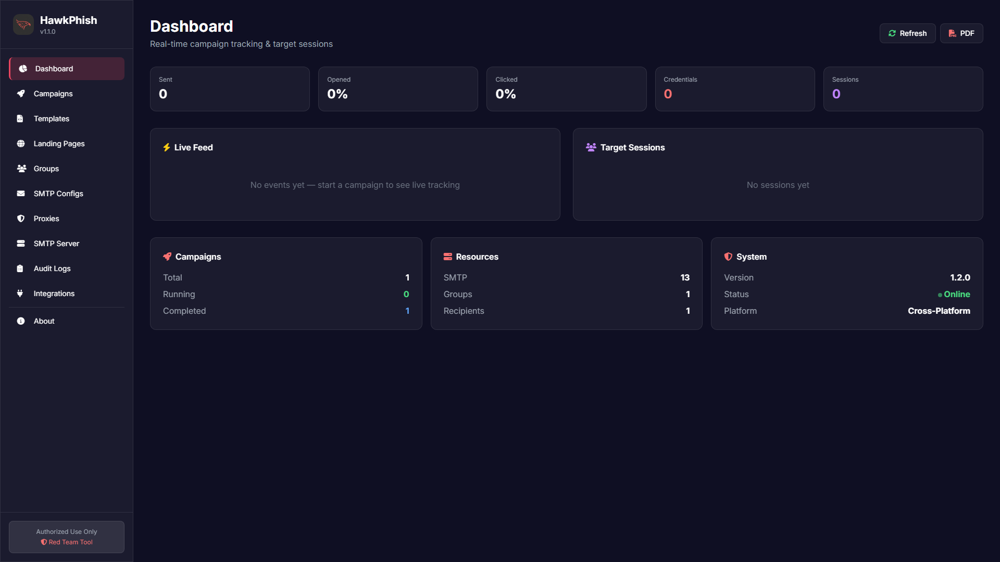

<div align="center">
  <br>
  
  <br><br>

  <h1 align="center" style="font-weight: 800; letter-spacing: -1px;">HawkPhish</h1>
  <p align="center">
    <strong>Advanced Phishing Simulation Platform</strong> for Red Teams & Security Awareness Training
  </p>

  <p align="center">
    
    
    
    
    
  </p>
</div>

<p align="center">
  <a href="#-features">Features</a> •
  <a href="#-tech-stack">Tech Stack</a> •
  <a href="#-installation">Installation</a> •
  <a href="#-usage-tutorial">Usage Tutorial</a> •
  <a href="#-support--donate">Support</a> •
  <a href="#-disclaimer">Disclaimer</a>
</p>

---

<div align="center">
  <br>
  
  <br>
  <p><em>Real-time dashboard with campaign tracking, live feed, target sessions and resource overview.</em></p>
  <br>
</div>

---

## 🦅 What is HawkPhish?

**HawkPhish** is a powerful, self-hosted phishing simulation platform designed for **authorized red team operations**, **penetration testers**, and **security awareness training programs**.

It gives you a complete workflow to build, launch, and measure phishing campaigns from a single dark-themed web dashboard:

- Craft convincing phishing emails with custom or pre-built HTML templates
- Host realistic landing pages that capture credentials
- Import target groups and rotate SMTP providers / proxies
- Track every open, click, and credential submission in real time
- Export professional PDF reports for stakeholders

Everything runs locally with a lightweight **FastAPI** backend, **SQLite** database, and a sleek **vanilla HTML + Tailwind CSS** frontend.

---

## ✨ Features

| Module | Description |
|--------|-------------|
| 📊 **Dashboard** | Live stats, open/click/submit rates, live feed, target sessions and system status. |
| 🚀 **Campaigns** | Create, start, pause, resume and cancel campaigns with random delays and proxy rotation. |
| 📧 **Email Templates** | Custom HTML editor with live preview, file upload, variables and 6+ pre-built templates. |
| 🌐 **Landing Pages** | Paste HTML, import any URL, upload files, or use 12+ pre-built login page templates. |
| 👥 **Target Groups** | Organize recipients, bulk-import via CSV, store names, positions and custom data. |
| 🔌 **SMTP Configs** | Supports 25+ providers (Office 365, Gmail, SendGrid, AWS SES, etc.) with health checks & bulk import. |
| 🛡️ **Proxy Rotator** | HTTP / HTTPS / SOCKS4 / SOCKS5 proxy rotation with latency testing and bulk import. |
| 📡 **Tracking** | Pixel tracking for opens, link tracking for clicks, credential capture and full session timelines. |
| 📄 **PDF Reports** | Download per-campaign or dashboard summary PDFs for reporting. |
| 🔒 **Ethical First** | Built-in warnings and "Authorized Use Only" branding. |

---

## 🛠️ Tech Stack

<div align="center">

  
  
  
  
  
  

</div>

**Backend**

- FastAPI (async Python)
- SQLAlchemy 2.0 + aiosqlite
- aiosmtplib, email-validator, Jinja2
- reportlab (PDF reports), Pillow + qrcode

**Frontend**

- Single-page vanilla JavaScript app
- Tailwind CSS (CDN)
- Font Awesome icons
- Responsive dark UI

---

## ⚡ Installation

### Requirements

- Python 3.11 or higher
- Windows / Linux / macOS
- (Optional) A valid SMTP server or API key for sending

### 1. Clone or extract the project

```bash
cd hawkphish
```

### 2. Create a virtual environment (recommended)

```bash
python -m venv venv
```

**Windows:**
```bash
venv\Scripts\activate
```

**Linux / macOS:**
```bash
source venv/bin/activate
```

### 3. Install dependencies

```bash
pip install -r requirements.txt
```

### 4. Run the application

```bash
cd backend
python main.py
```

The server will start on:

```
http://0.0.0.0:8000
```

Open your browser and navigate to:

```
http://localhost:8000
```

---

## 🎓 Usage Tutorial

### Step 1 — Configure an SMTP server

1. Go to **SMTP Configs** in the sidebar.
2. Click **New SMTP**.
3. Select your provider (Office 365, Gmail, SendGrid, AWS SES, etc.) or choose **Custom SMTP**.
4. Fill in the host, port, username, password / API key, and sender email.
5. Click **Create & Validate SMTP** to verify the connection.

> 💡 **Tip:** You can bulk-import SMTP configs from the **Bulk Import** button. Supported formats include:
> ```text
> smtp.office365.com|user@company.com|password||user@company.com
> smtp.gmail.com|you@gmail.com|app-password
> mail.example.com:465:user1{Pass123
> ```

### Step 2 — Add target recipients

1. Go to **Groups** and click **New Group**.
2. Give it a name, description, and color.
3. Open the group and add recipients one by one or use **Bulk Import**.

**Bulk import format:**
```csv
user1@example.com,John
user2@example.com,Jane
user3@example.com
```

### Step 3 — Create an email template

1. Go to **Templates** and click **New Template**.
2. Enter a name and subject.
3. Paste your HTML email body or upload an `.html` file.
4. Insert variables like `##email##`, `##first_name##`, `##link##`, `##domain##`, `##date##`.
5. Use the live preview to verify the design.

### Step 4 — Create a landing page (optional)

1. Go to **Landing Pages** and click **New Page**.
2. Paste custom HTML, upload a file, import from a URL, or pick a pre-built template (Google, Microsoft 365, etc.).
3. Define the fields you want to capture (default: `email`, `password`).
4. Set a redirect URL after submission if needed.

### Step 5 — Launch a campaign

1. Go to **Campaigns** and click **New Campaign**.
2. Select:
   - Email template
   - SMTP config
   - Target group
   - Landing page (optional)
3. Set min/max delay between emails.
4. Enable proxy rotation if you added proxies.
5. Click **Create Campaign**, then **Start**.

### Step 6 — Monitor results

1. Return to the **Dashboard**.
2. Watch the **Live Feed** for opens, clicks, and credential submissions.
3. Click any session in **Target Sessions** for a full event timeline.
4. Download PDF reports from the campaign list or dashboard.

---

## 🧪 API Endpoints

| Method | Endpoint | Description |
|--------|----------|-------------|
| GET | `/api/health` | Health check |
| GET/POST | `/api/campaigns` | List / create campaigns |
| POST | `/api/campaigns/{id}/start` | Start a campaign |
| POST | `/api/campaigns/{id}/pause` | Pause a campaign |
| GET | `/api/dashboard` | Dashboard statistics |
| GET | `/api/live-feed` | Recent target events |
| GET | `/api/sessions` | Target session list |

For full interactive docs, visit `/docs` after starting the server.

---

## 💰 Support & Donate

If HawkPhish helped your security work, consider supporting continued development. Any contribution keeps the project alive and updated.

<div align="center">

  <a href="#"></a>

  <p>
    <strong>Binance ID:</strong> <code>893759503</code>
  </p>

  <table>
    <tr>
      <td align="center">
        <br>
        <code>TNweg4pBxgtABK6g1Jb6isrn3PZawEizVJ</code>
      </td>
      <td align="center">
        <br>
        <code>13JxhEWzo21jcpbiyL8hvemeKEmXcrY7G2</code>
      </td>
    </tr>
    <tr>
      <td align="center">
        <br>
        <code>13JxhEWzo21jcpbiyL8hvemeKEmXcrY7G2</code>
      </td>
      <td align="center">
        <br>
        <code>0x0874626d93936f3e17591f10cfe5355e5fd7fcce</code>
      </td>
    </tr>
  </table>

</div>

---

## 📬 Contact & Issues

- **Author:** Qasim Ali — Security Researcher & Red Team Operator
- **Email:** [qasim.sec1401@proton.me](mailto:qasim.sec1401@proton.me)
- **GitHub:** [@QASIM1401](https://github.com/QASIM1401)
- **Bug Reports:** [GitHub Issues](https://github.com/QASIM1401/reconpro/issues)

---

## ⚠️ Disclaimer

**HawkPhish is intended for authorized security testing and educational purposes only.**

Phishing simulations must only be conducted against systems and individuals for whom you have **explicit written permission**. Unauthorized phishing, credential harvesting, or email spoofing is illegal in most jurisdictions and violates most service providers' terms of use.

The authors assume no liability for misuse of this tool. **Use responsibly and ethically.**

---

<div align="center">
  <br>
  
  <br>
  <p><strong>HawkPhish</strong> — See what others click.</p>
  <br>
</div>
